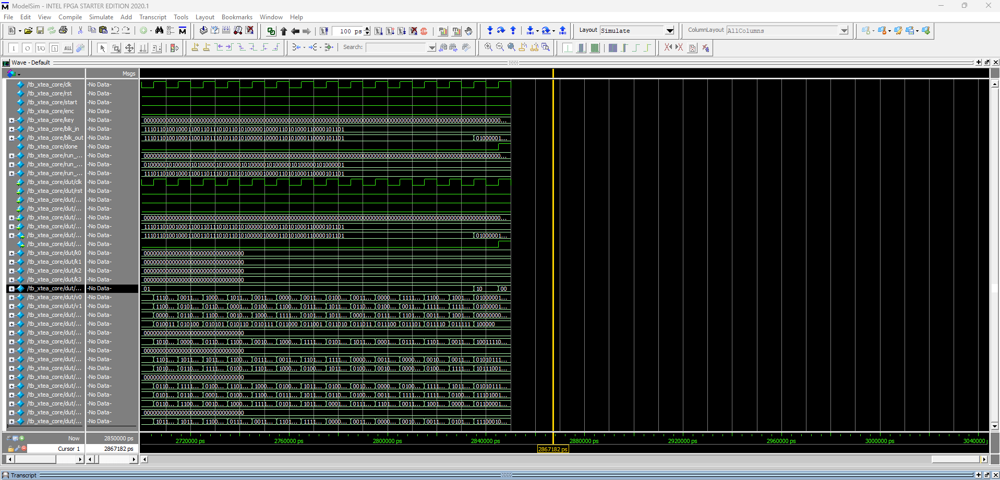
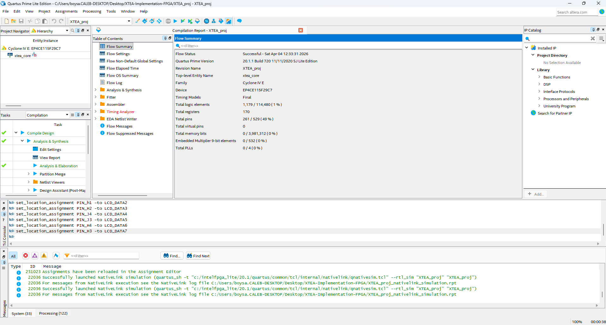
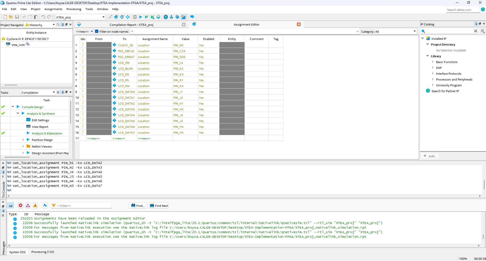

# Deliverable 2
*Caleb Acree*  
4/4/2026

### 32 Cycles
XTEA operates on a 64-bit block split into two 32-bit halves. Each cycle
updates both halves, making each cycle two Feistel half-rounds. In this
implementation, this maps directly to the `round` register, which counts 0–31,
meaning one cycle per iteration.

### Sum
`sum` is an accumulator that starts at 0 for encryption and increments or
decrements by `DELTA = 0x9E3779B9` each cycle, ensuring every round sees a
unique value. Two different bit fields of `sum` index into the four key words
`k0`–`k3` to select which key word gets mixed into each half-round, giving
XTEA its entire key schedule. `DELTA` is derived from the golden ratio because
its bit pattern causes the key selection to rotate unpredictably across all 32
rounds.

 Waveform

 Compilation

 Pins

